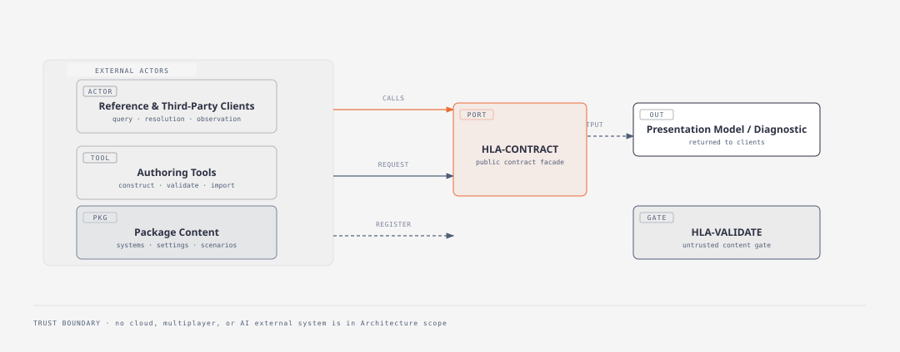

# High-Level Architecture (HLA)

Project Name: Campistoria Engine
Version: 1.0 (Approved)
Date (YYYY-MM-DD): 2026-09-12
Author(s): CodeMonki
Status: Approved
Requirement Version Reference: `docs/requirements/engine-srs.md` v1.0 (Approved)
RTM Version Reference: `docs/requirements/engine-rtm.md` v1.0 (Architecture mappings updated)
Working Glossary Reference: `docs/glossary.md` v0.1

**Terminology note:** The Gang-of-Four *Observer* design pattern (publish/subscribe notification) is unrelated to this project's domain term *Observer* (a viewpoint holding Observer Knowledge, per `engine-srs.md` §3.2). This document does not use the GoF Observer pattern to model the domain Observer concept, and calls this out explicitly wherever the two could be confused.

**Pattern documentation convention:** Per `CLAUDE.md` (ARC-004) and this project owner's direction, every structural component below names its governing pattern(s), states the rationale tying the pattern to specific Requirement IDs, and records alternatives that were considered and rejected, with the reason for rejection. This is written for readers beyond the immediate author, so rationale is spelled out rather than asserted.

---

## Table of Contents

- [1. Architectural Authority Declaration](#1-architectural-authority-declaration)
- [2. Architecture Overview](#2-architecture-overview)
  - [2.1 System Purpose](#21-system-purpose)
  - [2.2 Architectural Drivers](#22-architectural-drivers)
- [3. System Context and Boundaries](#3-system-context-and-boundaries)
  - [3.1 External Systems and Interfaces](#31-external-systems-and-interfaces)
  - [3.2 System Scope Boundaries](#32-system-scope-boundaries)
- [4. Deterministic–Probabilistic Boundary Model](#4-deterministicprobabilistic-boundary-model)
- [5. Architectural Style and Structural Model](#5-architectural-style-and-structural-model)
- [6. Major Components](#6-major-components)
- [7. Data Architecture](#7-data-architecture)
- [8. Non-Functional Architecture](#8-non-functional-architecture)
- [9. Failure Posture](#9-failure-posture)
- [10. Deployment and Packaging Alignment](#10-deployment-and-packaging-alignment)
- [11. Orchestration Alignment](#11-orchestration-alignment)
- [12. Risk Assessment](#12-risk-assessment)
- [13. Traceability Summary](#13-traceability-summary)
- [14. Open Questions](#14-open-questions)
- [15. Phase Gate Declaration](#15-phase-gate-declaration)
- [Approval](#approval)

---

# 1. Architectural Authority Declaration [↩](#table-of-contents "Back to ToC")

- Requirements phase approved? **Yes** — `engine-srs.md` v1.0, approved 2026-09-08.
- Requirement IDs stable? **Yes** — FR-001 through FR-044, NFR-001 through NFR-006.
- NFRs defined and measurable? **Yes** — see `engine-srs.md` §5; two carry provisional calibration values tracked as risk, not blockers (per project owner determination, 2026-09-08).
- Advancement to Architecture authorized? **Yes** — Requirements→Architecture gate cleared 2026-09-08 (`engine-srs.md` §16, `engine-rtm.md` §1).

---

# 2. Architecture Overview [↩](#table-of-contents "Back to ToC")

## 2.1 System Purpose

The Campistoria Engine is the reusable campaign-state runtime specified in `engine-srs.md`. It maintains authoritative Campaign Reality, keeps Observer Knowledge separate from it, resolves Unresolved State through an auditable Resolution mechanism, composes Package-defined game/world semantics, and exposes all of this through public contracts available identically to first-party and third-party callers.

This document translates that specification into structural form. It defines system boundaries, major components, their responsibilities, their governing patterns, and how non-functional requirements are enforced structurally. It does not select implementation language, storage technology, or deployment framework — those remain open per `engine-srs.md` §7 unless explicitly stated otherwise below.

Scope boundaries are unchanged from `engine-srs.md` §2.2: this HLA covers the engine only. Reference clients, authoring tools, and packages consume the contracts defined here but are architected separately.

## 2.2 Architectural Drivers

**Key functional drivers:**

- FR-013/FR-014 (Resolution vs. Oracle) — demands a structural boundary between deterministic state change and probabilistic input.
- FR-016/FR-017 (Observer Knowledge separation) — demands Campaign Reality and Observer Knowledge be structurally independent, not layered views of one store.
- FR-019–FR-026 (Package composition) — demands an extensible, plugin-style boundary for game/world semantics that the engine core does not know about at compile time.
- FR-039 (Non-privileged public contracts) — demands a single, symmetric entry surface rather than privileged internal shortcuts.
- FR-011/NFR-006 (History, Auditability) — demands that every consequential change be reconstructable and attributable.

**Key non-functional drivers:**

- NFR-001 (Performance) — local, in-process operation must not be architecturally coupled to a network hop.
- NFR-004/FR-043 (Scalability, archival access) — active working set must be structurally boundable independent of total campaign history size.
- NFR-002 (Security) — untrusted content (Packages, imports) must cross an explicit validation boundary before entering Campaign Reality.
- NFR-005 (Maintainability) — subsystems must remain separable as Package semantics evolve independently of engine mechanics.

**Constraints:** No regulatory constraints identified (`engine-srs.md` §8). No mandated technology stack (`engine-srs.md` §7) — deployment model, storage technology, and API transport remain open implementation decisions; this architecture is written to preserve that openness rather than foreclose it.

Every structural decision in Sections 5–9 traces to one or more of the drivers above or to a specific Requirement ID.

---

# 3. System Context and Boundaries [↩](#table-of-contents "Back to ToC")

## 3.1 External Systems and Interfaces

There are no external *systems* in scope — per `engine-srs.md` §13, cloud services, multiplayer infrastructure, and AI integration are deferred. The only external interfaces are the three actor types shown above, all interacting exclusively through HLA-CONTRACT (Section 6), whose validation of incoming Package content is detailed in HLA-VALIDATE.

**Trust boundaries:**

- Package content and imported Campaign data are untrusted until they pass HLA-VALIDATE (NFR-002).
- Client and authoring-tool requests are trusted to be well-formed at the transport level (transport is out of scope, per §2.2) but are always subject to POV Resolution (FR-028) before any content is returned — the engine, not the caller, decides what is valid to present.

## 3.2 System Scope Boundaries

**In architectural scope:** Campaign lifecycle, Campaign Reality, Campaign Time, Resolution, Observer Knowledge, Package composition, Query/POV/Presentation, Persistence/Portability, Checkpoint/Undo/Recovery/Retcon, Validation/Diagnostics, and the Public Contract surface — i.e., structural form for every FR group in `engine-srs.md` §4.

**Out of architectural scope:** Rendering, UI layout, authoring IDE internals, AI/cloud/multiplayer infrastructure (unchanged from `engine-srs.md` §2.2/§13). Specific transport protocol, storage engine, and programming language selection are also out of scope for this document — they are Detailed Design or later decisions, except where a structural pattern chosen here narrows (without fully deciding) that space; each such case is called out explicitly in Section 5.

No boundary ambiguity is carried forward from Requirements into this document.

---

# 4. Deterministic–Probabilistic Boundary Model [↩](#table-of-contents "Back to ToC")

**Probabilistic component identified:** package-defined Oracles (FR-014, `engine-srs.md` §6).

**Boundary declaration:** Oracle invocation is structurally isolated behind an **Oracle Adapter** (GoF Adapter pattern) inside HLA-RESOLUTION (Section 6). The Adapter's job is narrow and fixed: normalize a package-defined Oracle's output into the engine's uniform Resolution-input contract. It has no authority to write to Campaign Reality. This is a single, engine-owned, generic Adapter contract — every Package-defined Oracle conforms to the same interface rather than each Package supplying its own bespoke Adapter (resolved 2026-09-09; see HLA-RESOLUTION, Section 6). The contract is deliberately minimal — an opaque, Package-defined parameter payload in, a generic result envelope with provenance metadata out — specifically so it does not constrain an individual Oracle's internal behavior.

**Invocation contract:** Adapter accepts a Package-declared Oracle reference and any parameters the Oracle's own contract requires; it returns either a validated Oracle result or a validation failure. It never returns a Campaign Reality mutation directly.

**Validation harness strategy:** every Oracle result passes through HLA-VALIDATE (Chain of Responsibility, Section 6) against the Package's declared output contract before HLA-RESOLUTION's Command layer will accept it as Resolution input (FR-037).

**Containment logic:** only a Resolution Command (Section 6, HLA-RESOLUTION) may write to Campaign Reality. Oracle Adapters, Procedures, and Rules are all upstream of that single write path — there is exactly one gate through which probabilistic input can become deterministic state, which is what FR-014 requires structurally, not just procedurally.

**Fallback behavior:** if the Oracle Adapter cannot produce a valid result (Oracle failure, contract violation), the associated campaign element remains Unresolved (FR-012). No default or synthesized value is substituted.

**Observability mechanism:** every Resolution Command records its source — human decision, Procedure, Rule, or Oracle Adapter invocation — as part of the Event it appends to Campaign Core's log (FR-013, NFR-006).

**Reproducibility posture:** the per-Campaign seed (FR-044) is passed through the Oracle Adapter to any Oracle implementation that chooses to consume it. The Adapter does not impose a specific PRNG algorithm — that remains a Package/Detailed-Design decision, consistent with `engine-srs.md` FR-044's constraint that cross-implementation algorithm-sharing is not assumed.

There is no silent modality blending: nothing outside HLA-RESOLUTION's Command layer can mutate Campaign Reality, so a probabilistic result can never bypass the Adapter → Validate → Command path.

---

# 5. Architectural Style and Structural Model [↩](#table-of-contents "Back to ToC")

**Selected overall pattern: Hexagonal Architecture (Ports and Adapters, Cockburn).**

**Rationale:** The engine's defining structural requirement is symmetry — FR-039 requires that first-party and third-party clients, authoring tools, and Packages all interact through identical public contracts, with no privileged internal shortcut. Hexagonal Architecture expresses this directly: the engine core exposes a fixed set of **ports** (Query, Resolution, Package, Persistence), and every external actor — reference client or third-party tool alike — is just another **adapter** plugged into the same port. No actor is structurally closer to the core than any other. It also directly serves NFR-005 (Maintainability) and the "no mandated technology" constraint (`engine-srs.md` §7): because ports are transport- and technology-agnostic, deployment-model decisions (embedded library vs. hosted service, browser vs. native) become adapter choices made later, without changing the core's structure.

**Alternatives considered:**

- **Layered Architecture.** Rejected as the overall style. Layered architecture implies a single directional stack (e.g., UI → business logic → data), which naturally biases toward one primary caller sitting "on top." That conflicts with FR-039's requirement that multiple peer caller types (clients, authoring tools, third-party integrations) have equally direct access — there is no single "top" in this system's actual interaction pattern.
- **Event-Driven Architecture (as the overall style).** Rejected at the system level. The dominant interaction shape in `engine-srs.md` is synchronous request/response (a query returns a Presentation Model; a Resolution call returns success or a diagnostic) rather than asynchronous pub/sub between independently-deployed services. Adopting Event-Driven Architecture as the *overall* style would imply a distributed, asynchronous execution model that no FR requires and that would foreclose the embedded-library deployment option `engine-srs.md` §7 deliberately leaves open. (Event Sourcing, a related but distinct pattern concerned with *how state is persisted* rather than *how services communicate*, is used internally — see HLA-CORE, Section 6.)
- **Microkernel Architecture (as the overall style).** Considered seriously, since Package composition is genuinely a plugin problem. Not rejected outright — it is used, but scoped to the Package subsystem specifically (HLA-PACKAGE, Section 6) rather than applied to the whole engine, because most other components (Campaign Core, Resolution, Query) are not plugin-shaped; they are fixed engine responsibilities per `engine-srs.md` §"Engine Responsibilities."

**Structural layering within the hexagon:** Campaign Core (Section 6, HLA-CORE) sits at the center with no outward dependencies. Resolution, Observer Knowledge, and Package Composition depend on Core but not on each other except where explicitly noted (HLA-RESOLUTION depends on HLA-PACKAGE for Package-declared Oracle/Procedure/Rule references). Query, Persistence, Validation, and the Public Contract Facade depend on the above but are never depended upon by them — this is the dependency-direction rule: **ports point inward; adapters depend on ports, never the reverse.**

**Cross-cutting concerns:** Validation (HLA-VALIDATE) is invoked by every port that accepts external content (Package registration, Campaign import, Oracle results) rather than being embedded redundantly in each; this is enforced by routing all such content through Chain of Responsibility validators before it reaches Campaign Core or the Package registry.

Framework selection is not made here, consistent with `03-architecture-guardrail.md` §11 ("Tool-first architecture is prohibited").

---

# 6. Major Components [↩](#table-of-contents "Back to ToC")

Each component below states: Responsibility, Related Requirement IDs, Pattern(s), Rationale, Alternatives Considered (and why rejected), Key Interfaces, Dependency Constraints, and Data Ownership.

## HLA-LIFECYCLE — Campaign Lifecycle & Scenario Instantiation

- **Responsibility:** Instantiate a Campaign from a Scenario with a permanent, unique identity; assign a Campaign seed; keep Scenario content immutable; allow independent divergence of Campaigns sharing a Scenario.
- **Related Requirements:** FR-001, FR-002, FR-003, FR-040, FR-044.
- **Pattern:** Factory Method.
- **Rationale:** Campaign creation is exactly the Factory Method scenario — a creation operation (`instantiate(Scenario)`) that produces a new object (Campaign) from a template (Scenario) without exposing construction internals to the caller, and without the Scenario itself being mutated or consumed in the process (FR-040).
- **Alternatives considered:** *Prototype* — rejected; Prototype clones an existing instance of the *same* type to make a new one, but a Scenario is not a Campaign instance and is not "cloned into" a Campaign — it is a distinct, immutable template type, which breaks Prototype's core assumption. *Builder* — rejected as the primary pattern here; Builder suits multi-part, order-sensitive assembly (used instead in HLA-PACKAGE, below, for composing the Effective Campaign Definition), whereas Campaign instantiation from an already-resolved Scenario is a single creation step, not a multi-step assembly.
- **Key interfaces:** `createCampaign(scenarioRef) -> CampaignId`; exposed through HLA-CONTRACT.
- **Dependency constraints:** Depends on HLA-PACKAGE (a Scenario is Package-defined content) and HLA-CORE (to initialize Campaign Reality from the Scenario's initial state).
- **Data ownership:** Campaign identity and seed value. Does not own Campaign Reality content once created (HLA-CORE does).

## HLA-CORE — Campaign Reality & History

- **Responsibility:** Maintain Entities, Locations, Properties, Relationships, Facts, State, and Campaign Time; record Events sufficient to reconstruct history.
- **Related Requirements:** FR-004, FR-005, FR-006, FR-007, FR-008, FR-009, FR-010, FR-011.
- **Pattern:** Event Sourcing.
- **Rationale:** Every FR in this group either directly requires historical reconstruction (FR-011), temporally-bounded state queries (FR-009), or provenance/temporal-validity on Facts (FR-008) — Event Sourcing satisfies all three by construction, since "state at time T" is simply a fold over the event log up to T, and "history" is the log itself rather than a separately-maintained artifact that can drift out of sync with current state.
- **Alternatives considered:** *Mutable CRUD store with a bolted-on audit log* — rejected; maintaining current state and a separate audit trail as two artifacts risks them drifting inconsistent under partial failure, which directly threatens NFR-003 (Reliability) and NFR-006 (Auditability). Event Sourcing makes the log the single source of truth, structurally preventing that drift rather than relying on discipline to prevent it.
- **Key interfaces:** `appendEvent(event)`, `stateAt(objectId, campaignTime)`, `history(range)`. Consumed internally by HLA-RESOLUTION (writes) and HLA-QUERY (reads); never written to directly by any adapter outside HLA-RESOLUTION.
- **Dependency constraints:** No outward dependencies — this is the center of the hexagon (Section 5).
- **Data ownership:** Campaign Reality: Entities, Locations, Properties, Relationships, Facts, State, Events, Campaign Time.

## HLA-RESOLUTION — Unresolved State, Resolution, and the Oracle Boundary

- **Responsibility:** Represent Unresolved State explicitly; execute Resolution actions from human decisions, Procedures, Rules, or Oracle results; own the deterministic–probabilistic boundary (Section 4).
- **Related Requirements:** FR-012, FR-013, FR-014, and the whole of `engine-srs.md` §6.
- **Pattern:** Command (for Resolution actions) + Adapter (for Oracle normalization, detailed in Section 4).
- **Rationale:** A Resolution is a request to change Campaign Reality that must be attributable to a source, auditable (NFR-006), and — per FR-034 — undoable. That is precisely GoF Command's intent: encapsulate a request as an object so it can be logged, queued, and reversed. Modeling Resolution as a Strategy (interchangeable resolution algorithms) was the closest competing idea but doesn't naturally carry the "this specific invocation, with this source, happened at this time and can be undone" semantics that Command provides as a first-class property of the pattern.
- **Alternatives considered:** *Strategy* — rejected as primary; a Strategy answers "which algorithm produced this value," not "log this specific occurrence and allow it to be undone," which is what FR-013/FR-034 actually need. Strategy is used instead where interchangeable algorithms actually are the right shape (HLA-QUERY's Projections, below). *Direct mutation with a logging side-effect* — rejected; makes Undo (FR-034) an ad hoc reverse-operation per call site rather than a structural property of every Resolution. *Per-Package bespoke Oracle Adapters* (each Package defines its own Adapter shape) — considered and rejected 2026-09-09 in favor of one engine-owned generic Adapter contract: a single contract lets HLA-VALIDATE check every Oracle result the same way instead of needing bespoke validation per Package, keeps NFR-006 provenance-recording logic written once rather than duplicated, and matches "the engine knows the meta-model, Packages know the game" more cleanly than letting Adapter *shape* vary as Package-specific content. The accepted trade-off is reduced per-Oracle flexibility, mitigated by keeping the generic contract's payload/result envelope deliberately minimal and opaque rather than over-specified.
- **Key interfaces:** `resolve(unresolvedRef, source, payload) -> ResolutionRecord`; `invokeOracle(oracleRef, params) -> OracleResult | ValidationFailure` (via the Oracle Adapter).
- **Dependency constraints:** Writes exclusively to HLA-CORE. Depends on HLA-PACKAGE for Oracle/Procedure/Rule definitions and HLA-VALIDATE for Oracle result validation. No other component may write to Campaign Reality (Section 4).
- **Data ownership:** Unresolved State markers and Resolution provenance records (source, timestamp, prior Oracle result reference if any).

## HLA-OBSERVER — Observer Knowledge

- **Responsibility:** Maintain Observers and their Observer Knowledge, each with recorded Information Source, structurally independent from Campaign Reality.
- **Related Requirements:** FR-015, FR-016, FR-017, FR-018.
- **Pattern:** Event Sourcing, applied as an independently-keyed stream per Observer.
- **Rationale:** Reusing Event Sourcing (already justified for HLA-CORE) gives Observer Knowledge the same provenance/history properties Campaign Reality gets, for the same reasons — but keeping it a **separate** stream per Observer, never merged with Campaign Core's log, is what structurally enforces FR-016 ("Observer Knowledge is separate from Campaign Reality") rather than relying on query-time filtering to fake the separation.
- **Alternatives considered:** *Decorator or Proxy over Campaign Core* — explicitly rejected, not merely set aside. Both patterns wrap and extend the *same* underlying subject, which directly contradicts FR-016/FR-017's requirement that Observer Knowledge be a genuinely separate store that can diverge arbitrarily from Campaign Reality. Using either pattern here would make the required separation cosmetic rather than structural. *A single shared event log with type-tagged entries* — rejected; mixing streams risks accidental cross-query leakage between Campaign Reality and Observer Knowledge, which would undermine the "inspectable authoritative state" constraint (`engine-srs.md` §7) by making it possible to query one and get contamination from the other.
- **Key interfaces:** `recordObservation(observerId, informationSource, content)`, `knowledgeOf(observerId, subject, campaignTime)`.
- **Dependency constraints:** Reads from HLA-CORE only for cross-referencing subjects (an Observer's knowledge is *about* a Campaign Reality object, but does not inherit that object's Campaign Reality values). Never writes to HLA-CORE.
- **Data ownership:** Observer identities, Observer Knowledge records, Information Source provenance.

## HLA-PACKAGE — Package Composition & Versioning

- **Responsibility:** Register Packages; compose Systems/Settings/Scenarios/Rules/Oracles/Procedures/Overrides into an Effective Campaign Definition; enforce version pinning, explicit migration, coexisting versions, and dependency-aware removal.
- **Related Requirements:** FR-019 through FR-026.
- **Pattern:** Microkernel (subsystem-level) + Builder (composition-process-level).
- **Rationale:** Microkernel fits the subsystem as a whole because the engine core has no compile-time knowledge of any specific game system, setting, or scenario (`engine-primer.md`, "The engine knows the meta-model; packages know the game and world model") — Packages are plugins loaded against a fixed core contract, which is Microkernel's defining shape. Within that, the actual act of composing one Effective Campaign Definition out of several declared parts, in a defined order, with explicit override/extension application (FR-020, FR-021), is a multi-step assembly process — Builder's defining shape — rather than a single-step creation (ruling out Factory Method here) or a copy of an existing instance (ruling out Prototype).
- **Alternatives considered:** *Prototype* — rejected; there is no existing Effective Campaign Definition to clone when composing a new one from scratch. *Plain Strategy (one algorithm picks the "winning" definition on conflict)* — rejected; FR-021 explicitly requires composition conflicts to fail loudly rather than be silently resolved by picking a winner, which a simple conflict-resolution Strategy would otherwise invite.
- **Key interfaces:** `registerPackage(package)`, `compose(systemRef, settingRef, scenarioRef, overrides[]) -> EffectiveCampaignDefinition`, `migrate(campaignId, newComposition)`, `removePackage(packageRef, force?)`.
- **Dependency constraints:** No dependency on HLA-CORE or HLA-RESOLUTION (Packages are defined independently of any running Campaign). HLA-LIFECYCLE and HLA-RESOLUTION depend on HLA-PACKAGE, not the reverse.
- **Data ownership:** Package registry, version metadata, Effective Campaign Definitions, per-Campaign composition pins.

## HLA-QUERY — Query, POV Resolution & Presentation

- **Responsibility:** Answer queries against Campaign Reality and (via POV Resolution) Observer Knowledge; generate Presentation Models for multiple Projection types from shared underlying state; hold sole authority over what is valid to present.
- **Related Requirements:** FR-027, FR-028, FR-029, FR-030.
- **Pattern:** Facade (unified query entry point) + Strategy (interchangeable Projection algorithms).
- **Rationale:** FR-028 requires the engine, not the client, to decide what's presentable — a Facade concentrates that authority in one place rather than letting each Projection type independently reimplement POV filtering (which would risk one Projection leaking data another correctly withholds). Strategy fits the Projection layer because Map, Timeline, Roster, and Journal Projections (FR-030) share almost no algorithmic structure with each other beyond a common input/output shape — they are fully interchangeable algorithms selected by Projection type, not variations on one fixed skeleton.
- **Alternatives considered:** *Visitor*, for traversing Campaign Reality's object graph per Projection — rejected. Visitor assumes a fixed, closed set of element types known at the time the Visitor is written, but `engine-srs.md`'s Entity/Relationship/Fact types are Package-extensible and open-ended (`engine-ideation.md`, "the engine knows the meta-model; packages know the game and world model") — a genuinely open type set is exactly what Visitor is unsuited for. *Template Method* for Projection generation — rejected; the Projection types don't share enough of a common algorithmic skeleton to justify a fixed base-class structure with varying steps.
- **Key interfaces:** `query(observerId, context, campaignTime, projectionType) -> PresentationModel`.
- **Dependency constraints:** Reads from HLA-CORE and HLA-OBSERVER. Never writes to either. Depended upon only by HLA-CONTRACT.
- **Data ownership:** None persistent — Presentation Models are computed on demand, not stored as authoritative state.

## HLA-PERSIST — Persistence & Portability

- **Responsibility:** Durable storage of Campaign Reality/Observer Knowledge/Package composition; implementation-neutral import/export; Campaign-local asset portability; on-demand access to archived history outside the active window.
- **Related Requirements:** FR-031, FR-032, FR-042, FR-043.
- **Pattern:** Adapter, layered over the Event Sourcing store already established in HLA-CORE/HLA-OBSERVER.
- **Rationale:** Persistence is not a separate storage paradigm — it is the durable backing of the same event logs, exposed through format-specific Adapters (FR-032's "implementation-neutral" representation) that translate the internal event/snapshot model to and from an external representation, without the internal model needing to know about any specific external format.
- **Alternatives considered:** *A dedicated persistence-specific data model, separate from the Event Sourcing log* — rejected; maintaining a second representation purely for persistence purposes reintroduces the same drift risk that Event Sourcing was chosen in HLA-CORE specifically to avoid.
- **Key interfaces:** `export(campaignId, format) -> ExportArtifact`, `import(artifact) -> CampaignId`, `resolveArchived(campaignId, timeRange) -> HistoricalData` (FR-043).
- **Dependency constraints:** Depends on HLA-CORE and HLA-OBSERVER for the data it persists. Depended upon by HLA-CONTRACT only.
- **Data ownership:** Durable storage representation, archival tier, exported artifact formats. Does not own the authoritative in-memory/active-window state (HLA-CORE/HLA-OBSERVER do).

## HLA-STATE — Checkpoint, Undo, Recovery, and Retcon

- **Responsibility:** Create/restore Checkpoints; support Undo of unwanted operations; recover from technical failure; execute human-authorized Retcons with provenance.
- **Related Requirements:** FR-033, FR-034, FR-035, FR-036.
- **Pattern:** Memento (Checkpoint/Recovery) + reuse of HLA-RESOLUTION's Command infrastructure (Undo).
- **Rationale:** A Checkpoint is, definitionally, GoF Memento's stated purpose — "capture and externalize an object's internal state without violating its encapsulation, so it can be restored later." HLA-CORE (the Memento *originator*) produces the snapshot; HLA-STATE acts as the *caretaker*, holding Checkpoints without needing to understand Campaign Reality's internals. Undo does not need a new pattern — because Resolution is already modeled as Command (HLA-RESOLUTION), Undo is simply that Command's inverse operation, applied without becoming part of permanent history (FR-034's "not recorded as part of Campaign history").
- **Alternatives considered:** *Ad hoc full-state copy without an originator/caretaker distinction* — rejected; Memento's explicit role separation is what keeps Checkpoint restoration from needing to know Campaign Reality's internal structure, which matters given that structure is Package-extended and not fixed. Modeling Retcon as silent direct mutation — rejected; FR-036 requires provenance and direct-reference identification, so Retcon is instead implemented as a compensating Event appended to HLA-CORE's log (preserving the append-only guarantee Event Sourcing depends on), not a rewrite of prior events.
- **Checkpoint cadence (resolved 2026-09-09):** a Checkpoint is triggered by whichever of the following occurs first: 60 minutes of wall-clock (real-world) elapsed time since the last Checkpoint, 50 Events appended since the last Checkpoint, or a graceful application close. Wall-clock time, not Campaign Time, governs the time-based trigger — this is a reliability mechanism (bounding crash/recovery data loss, FR-035/NFR-003), not a campaign-scale mechanism (that's NFR-004's active-window concern), and conflating the two was an early risk this document specifically avoided (see `engine-srs.md` NFR-004's own "day" unit clarification for the precedent). The event-count trigger is a backstop against unusually dense play producing a large replay chain within a single hour. Both numbers are provisional defaults, not derived from real usage data — expected to be configurable rather than hardcoded, and revisited once Event granularity is settled in Detailed Design (see Section 12 risk: "Event Sourcing replay cost grows unbounded...").
- **Key interfaces:** `checkpoint(campaignId) -> CheckpointRef`, `restore(checkpointRef)`, `undo(resolutionRef)`, `recover(campaignId)`, `retcon(factRef, newValue) -> RetconRecord`.
- **Dependency constraints:** Depends on HLA-CORE (Memento originator) and HLA-RESOLUTION (Command reuse for Undo). Depended upon only by HLA-CONTRACT.
- **Data ownership:** Checkpoint snapshots, Retcon provenance records. Does not own live Campaign Reality.

## HLA-VALIDATE — Validation & Diagnostics

- **Responsibility:** Validate Package/Campaign consistency, imported data, and Oracle results at every trust boundary; produce structured diagnostics.
- **Related Requirements:** FR-037, FR-038, NFR-002.
- **Pattern:** Chain of Responsibility.
- **Rationale:** Validation rules are contributed by multiple sources (engine-level structural checks, Package-declared schema/contract checks) and must be composable without the engine needing a fixed, closed validation algorithm. Chain of Responsibility lets each validator handle what it knows about and pass the rest along, which is the right shape for a validation set that grows as Packages are added — a fixed algorithm (Template Method) would have to be rewritten every time a new kind of check was needed.
- **Alternatives considered:** *Template Method* — rejected; fixes the validation algorithm's skeleton in one place, which conflicts with Package-contributed, variable validation rule sets. *Visitor* — rejected for the same open-type-hierarchy reason given in HLA-QUERY.
- **Key interfaces:** `validate(subject) -> ValidationResult[]`. Invoked by HLA-PACKAGE (registration), HLA-PERSIST (import), and HLA-RESOLUTION (Oracle results) — never bypassed.
- **Dependency constraints:** Has no dependency on any other component's internals beyond the subject being validated; other components depend on it, not the reverse.
- **Data ownership:** None persistent — validation is a stateless pass over supplied content.

## HLA-CONTRACT — Public Contract Facade

- **Responsibility:** The single entry surface through which every external actor (reference client, third-party client, authoring tool, third-party integration) invokes engine capability — identically, per FR-039.
- **Related Requirements:** FR-039 (primary); every other FR indirectly, since all of them are reached through this Facade.
- **Pattern:** Facade.
- **Rationale:** FR-039's actual requirement is structural, not just aspirational: there must be *one* surface, not "the reference client's internal shortcut" plus "the public API for everyone else." A Facade forces that by construction — every caller, first-party or third-party, calls the same operations with no alternate path into HLA-CORE, HLA-RESOLUTION, or any other internal component.
- **Alternatives considered:** *No Facade — expose each subsystem's interface directly* — rejected; this is the real fork here, and it was rejected specifically because it would leave the door open for a first-party client to be built against internal component interfaces directly (a "privileged shortcut"), which is exactly what FR-039 prohibits.
- **Key interfaces:** Aggregates the public operations of HLA-LIFECYCLE, HLA-RESOLUTION, HLA-OBSERVER (observation-recording only), HLA-PACKAGE, HLA-QUERY, HLA-PERSIST, and HLA-STATE into one documented surface.
- **Authorization posture:** HLA-CONTRACT is also the expected choke point for actor/session authorization before any mutating operation reaches HLA-RESOLUTION, HLA-OBSERVER, HLA-PACKAGE, HLA-STATE, or HLA-PERSIST. The likely model is role-based assignment of capability bundles with explicit capability checks as the enforcement primitive; the exact role/capability taxonomy remains open (Section 14).
- **Dependency constraints:** Depends on all other components. No other component depends on it.
- **Data ownership:** None — pure aggregation/routing layer.

**Orphan check:** every component above traces to at least one Requirement ID; every FR group in `engine-srs.md` §4 maps to at least one component (see Section 13).

---

# 7. Data Architecture [↩](#table-of-contents "Back to ToC")

**Persistence model:** an append-only Event log per Campaign (HLA-CORE) and per Observer (HLA-OBSERVER), with periodic Memento-pattern snapshots (HLA-STATE) bounding replay cost. The active working set (NFR-004) is the most recent segment of that log plus its nearest snapshot; older segments move to archival storage accessible on demand (FR-043) without being loaded for ordinary queries.

**Data ownership boundaries:** Campaign Reality (HLA-CORE) and Observer Knowledge (HLA-OBSERVER) are separate logs, never merged (Section 6, HLA-OBSERVER rationale). Package definitions (HLA-PACKAGE) are independent of any specific Campaign's data. Presentation Models (HLA-QUERY) are never persisted as authoritative data — they are always recomputed from the logs above.

**Data lifecycle:** Scenario (immutable) → Campaign instantiation (HLA-LIFECYCLE) → Event append during play (HLA-RESOLUTION writes, HLA-OBSERVER writes) → periodic Checkpoint (HLA-STATE) → archival transition of aged-out segments (HLA-PERSIST) → on-demand archival retrieval (FR-043) → export/import (HLA-PERSIST, FR-032).

**Consistency guarantees:** each Resolution Command (HLA-RESOLUTION) is atomic with respect to Campaign Reality — it either fully appends its Event or has no effect; there is no partially-applied Resolution state. Package migration (FR-023, FR-041) is likewise atomic: a failed migration leaves the prior pinned composition fully intact, never a mixture of old and new.

**Cross-boundary data flows:** Package content flows from HLA-PACKAGE into HLA-CORE/HLA-RESOLUTION only after HLA-VALIDATE clears it. Imported Campaign data flows from HLA-PERSIST into HLA-CORE/HLA-OBSERVER, likewise gated by HLA-VALIDATE. No component reads another's owned data without going through that owner's interface (no shared mutable storage between components).

**Validation checkpoints:** Package registration, Campaign import, and Oracle result acceptance are the three points at which HLA-VALIDATE is mandatorily invoked (Section 6). There is no fourth path into Campaign Reality that bypasses these.

No hidden data flow exists: every arrow in the Section 3.1 diagram and every "Key Interfaces" entry in Section 6 is the complete set of ways data moves between components.

---

# 8. Non-Functional Architecture [↩](#table-of-contents "Back to ToC")

| NFR | Structural Enforcement Mechanism |
|---|---|
| NFR-001 (Performance) | HLA-CONTRACT is an in-process Facade call, not a network boundary by default — Hexagonal ports (Section 5) allow a network adapter to be added later without restructuring the core, but nothing in this architecture *requires* one, preserving the local-call performance path NFR-001 measures against. |
| NFR-002 (Security) | HLA-VALIDATE's Chain of Responsibility is the mandatory gate before Package or import content reaches HLA-CORE/HLA-PACKAGE (Section 7). No component-level bypass exists. |
| NFR-003 (Reliability) | Event Sourcing (HLA-CORE/HLA-OBSERVER) plus Memento-based Checkpoint/Recovery (HLA-STATE) means recovery is "replay from last valid snapshot," not ad hoc repair — silent corruption would require the log itself to be corrupted, not just an in-memory structure. |
| NFR-004 (Scalability) | The active-window/archival split (Section 7) is the direct structural implementation of NFR-004's bounded-working-set requirement; FR-043's on-demand archival retrieval is HLA-PERSIST's `resolveArchived` interface. |
| NFR-005 (Maintainability) | Hexagonal ports (Section 5) isolate each component behind a fixed interface; HLA-PACKAGE's Microkernel boundary isolates Package semantics from engine mechanics, so either can evolve without the other changing shape. |
| NFR-006 (Auditability) | Event Sourcing's append-only log is inherently an audit trail; HLA-RESOLUTION's Command pattern additionally records Resolution source on every write (Section 4). |

No NFR compliance is assumed without a named mechanism above, per `04-templates/system/architecture-template.md` §8.

---

# 9. Failure Posture [↩](#table-of-contents "Back to ToC")

- **Deterministic failure modes:** Package/import validation failure (HLA-VALIDATE rejects; FR-037/FR-038 diagnostics returned, no partial state change). Migration failure (FR-041: prior pinned composition remains fully intact).
- **Probabilistic failure modes:** Oracle Adapter failure or contract-violating result (Section 4: element remains Unresolved, FR-012; no synthesized fallback value).
- **Integration failure scenarios:** malformed Package or export artifact submitted to HLA-PERSIST/HLA-PACKAGE — rejected at HLA-VALIDATE with structured diagnostics (FR-038), never partially imported.
- **Degradation strategy:** if archival storage (HLA-PERSIST) is unreachable, the active working set (HLA-CORE/HLA-OBSERVER) remains fully queryable; only `resolveArchived` (FR-043) calls fail, with an explicit diagnostic rather than a silent empty result.
- **Recovery strategy:** Event log replay from the last valid Checkpoint (HLA-STATE, Memento pattern) satisfies FR-035 without manual data repair.
- **Rollback posture:** Undo (FR-034) reverses a single Resolution Command without becoming history; Retcon (FR-036) appends a compensating Event rather than rewriting the log, preserving Event Sourcing's append-only guarantee under correction.
- **Risk concentration points:** HLA-CORE's Event log and HLA-VALIDATE's gate are the two components whose failure has the widest blast radius, since every other component depends on one or both (Section 5 dependency direction). Both carry High priority in Section 12.

Failure posture is recorded at the structural level only; specific retry counts, timeout values, and error-code schemes are Detailed Design decisions.

---

# 10. Deployment and Packaging Alignment [↩](#table-of-contents "Back to ToC")

No target runtime environment, containerization approach, or networking model is selected here — `engine-srs.md` §7 leaves deployment model, storage technology, and API transport open, and Section 5's choice of Hexagonal Architecture is specifically what preserves that openness structurally: HLA-CONTRACT can be adapted to an embedded-library call, an in-process service, or a networked API without any other component changing, because every other component only ever talks to ports, never to a specific transport.

Artifact boundaries: the engine core (HLA-CORE through HLA-VALIDATE) is architecturally a single deployable unit with no internal network dependency; HLA-CONTRACT is the only component whose deployment shape (embedded vs. hosted) is left open by design.

Configuration boundaries: Package registration (HLA-PACKAGE) and storage backend selection (HLA-PERSIST) are the two points where deployment-specific configuration enters the system; neither is specified further here.

---

# 11. Orchestration Alignment [↩](#table-of-contents "Back to ToC")

No build tooling, dependency manager, or CI/CD platform is selected at this phase, consistent with `engine-srs.md` §7. This architecture does not conflict with orchestration requirements because no component assumes a specific build system: the Hexagonal boundary (Section 5) means each component (Section 6) can, in principle, be built and tested independently of the others, which is the only orchestration-relevant property this document commits to. Concrete CI/CD alignment is a Detailed Design / Packaging-phase concern (`ai-toolkit/02-governance/11-orchestration-guardrail.md`).

---

# 12. Risk Assessment [↩](#table-of-contents "Back to ToC")

| Risk | Category | Level | Related Component(s) |
|---|---|---|---|
| Event Sourcing replay cost grows unbounded for very long campaigns if snapshotting cadence is wrong | Scalability | High | HLA-CORE, HLA-STATE |
| HLA-VALIDATE becomes a bottleneck or is bypassed under implementation pressure, undermining NFR-002 | Structural | High | HLA-VALIDATE |
| Microkernel boundary (HLA-PACKAGE) erodes if a Package is ever allowed engine-core access as a shortcut | Structural / Scope drift | High | HLA-PACKAGE |
| Facade (HLA-CONTRACT) accumulates a first-party-only "back door" during implementation, silently violating FR-039 | Structural / Scope drift | High | HLA-CONTRACT |
| Mutating client operations are validated for shape but not authorized by actor capability, allowing player or tool clients to perform GM/campaign-owner operations | Security / Authority | High | HLA-CONTRACT, HLA-RESOLUTION, HLA-STATE |
| Oracle Adapter boundary (Section 4) is bypassed by a Package invoking Resolution directly | Probabilistic containment | Moderate | HLA-RESOLUTION |
| Observer Knowledge and Campaign Reality logs are merged for storage convenience during implementation | Structural | Moderate | HLA-OBSERVER, HLA-CORE |
| Archival tier (HLA-PERSIST) design is deferred so long that NFR-004's active-window default is never empirically validated | Requirement ambiguity | Moderate | HLA-PERSIST |
| Chosen patterns (Command, Memento, Event Sourcing) impose more implementation complexity than a small first release needs | Scope / delivery risk | Moderate | HLA-CORE, HLA-RESOLUTION, HLA-STATE |
| Deployment-model deferral (Section 10) leads to a HLA-CONTRACT design that doesn't actually adapt cleanly to both embedded and hosted modes | Architectural | Low | HLA-CONTRACT |

The High-risk items concern structural boundaries that are easy to state and easy to erode under implementation pressure; they should be explicit acceptance criteria in Detailed Design and Test Planning, not just documented here.

---

# 13. Traceability Summary [↩](#table-of-contents "Back to ToC")

Reference: `docs/requirements/engine-rtm.md`. This HLA introduces the following Requirement-to-Component mapping, now reflected in the RTM's Core Traceability Matrix (RTM Section 2, "HLA Component ID" column):

| Requirement Group | HLA Component(s) |
|---|---|
| FR-001, FR-002, FR-003, FR-040, FR-044 | HLA-LIFECYCLE |
| FR-004–FR-011 | HLA-CORE |
| FR-012, FR-013, FR-014 | HLA-RESOLUTION |
| FR-015, FR-016, FR-017, FR-018 | HLA-OBSERVER |
| FR-019–FR-026 | HLA-PACKAGE |
| FR-027, FR-028, FR-029, FR-030 | HLA-QUERY |
| FR-031, FR-032, FR-042, FR-043 | HLA-PERSIST |
| FR-033, FR-034, FR-035, FR-036 | HLA-STATE |
| FR-037, FR-038 | HLA-VALIDATE |
| FR-039 | HLA-CONTRACT |
| FR-041 | HLA-PACKAGE, HLA-STATE |
| NFR-001–NFR-006 | See Section 8 (cross-cutting; no single owning component) |

- All Architectural Components map to Requirement IDs? **Yes** (table above).
- No orphan requirements? **Yes** — every FR/NFR in `engine-srs.md` appears in the table above or in Section 8.
- No untraceable structural elements? **Yes** — every component in Section 6 states its Related Requirements.

This table has been applied to `engine-rtm.md` as part of Architecture approval.

---

# 14. Open Questions [↩](#table-of-contents "Back to ToC")

**Resolved since initial draft (2026-09-09, project owner discussion):**

- Snapshot/Checkpoint cadence — resolved as a hybrid trigger (60 minutes wall-clock, 50 Events, or graceful close, whichever comes first), both values provisional pending real usage data. See HLA-STATE, Section 6.
- Oracle Adapter shape — resolved as a single, engine-owned, generic contract rather than per-Package bespoke Adapters. See Section 4 and HLA-RESOLUTION, Section 6.

**Still open:**

- Does Package composition (HLA-PACKAGE, Builder) require a declarative composition language, or is structured data sufficient? `engine-ideation.md` prefers declarative packages generally; this HLA does not decide the specific mechanism.
- Should HLA-CONTRACT's embedded-vs-hosted deployment adapter be decided now or left fully open through Detailed Design? Currently left fully open (Section 10); flagged here in case that turns out to constrain HLA-PERSIST's storage choice more than currently assumed.
- Should client synchronization use a revision or delta-number handshake? A client with a previously received reality or Presentation Model state could reconnect by sending its last known delta number, allowing the engine to decide whether to return missing deltas or a fresh full snapshot. This is especially relevant for network-connected clients that may lose connectivity intermittently, but the exact contract belongs in Detailed Design after HLA-CONTRACT and HLA-QUERY interfaces are refined.
- Should mutation authority be modeled as role-based assignment of capability bundles, with HLA-CONTRACT enforcing explicit capabilities before forwarding mutating requests? Candidate privileged capabilities include retcon, package migration, checkpoint rollback, destructive import, permission management, and direct Campaign Reality mutation; exact role names and capability IDs belong in Detailed Design and may require Requirements review if multi-actor play is reopened.
- Exact archival storage technology and format for HLA-PERSIST's cold tier — explicitly deferred per `engine-srs.md` §7.

The remaining open questions are Detailed Design inputs rather than Architecture-phase blockers. They do not prevent advancement, provided they are carried forward into Detailed Design and normal RTM/change-control handling. Campistoria is being developed using a Spiral Development model, so later discovery of missed requirements, risk refinements, or needed phase rollback is expected to be handled explicitly rather than treated as an architecture-approval failure.

---

# 15. Phase Gate Declaration [↩](#table-of-contents "Back to ToC")

- All mandatory sections completed? **Yes.**
- Deterministic–probabilistic boundaries defined? **Yes** (Section 4).
- NFR-driven structure demonstrated? **Yes** (Section 8).
- RTM updated? **Yes** — HLA component mappings have been written into `engine-rtm.md`.
- Human approval granted? **Yes** — approved by the project owner (CodeMonki) on 2026-09-12.

All Gate 3→4 criteria are satisfied. Advancement to Detailed Design is authorized as of this approval.

---

# Approval [↩](#table-of-contents "Back to ToC")

Approved By: CodeMonki
Role: Project Owner
Date: 2026-09-12
Version Incremented: Yes — v1.0

Advancement to Detailed Design is authorized per lifecycle governance.

---

End of High-Level Architecture (Approved v1.0)
